# Flutter Advanced Calculator

A professional, feature-rich calculator application built with Flutter. This project demonstrates advanced state management, complex expression parsing, data persistence, and a responsive UI with both Light and Dark themes.

> **Student:** Nguyen Van Tien
> **Course:** Mobile Application Development
> **Chapter:** 3 - Advanced Mobile Calculator

## 🌟 Project Description & Features

This application goes beyond basic arithmetic, offering a comprehensive tool for students and professionals. It implements the **MVVM architecture** using the **Provider** pattern for state management.

### Key Features:
* **Three Calculation Modes:**
    * **Basic:** Standard arithmetic operations (+, -, ×, ÷).
    * **Scientific:** Advanced functions (Trigonometry, Logarithms, Powers, Roots, Factorial).
    * **Programmer:** Binary, Octal, Decimal, Hexadecimal conversions and Bitwise operations (AND, OR, XOR, NOT, Shifts).
* **Advanced Expression Parser:** Handles complex mathematical expressions with proper operator precedence (PEMDAS) and parentheses.
* **Smart History System:** Persists calculation history using `shared_preferences`. Swipe to delete, tap to reuse results.
* **Memory Functions:** Standard memory operations (M+, M-, MR, MC).
* **Dynamic Theming:** Seamless switching between Light, Dark, and System themes with distinct color palettes (Light: #1E1E1E/#FF6B6B, Dark: #121212/#4ECDC4).
* **Settings:** Customize decimal precision, angle modes (RAD/DEG), and clear data.

## 📸 Screenshots

### 1. Overview & Themes
| Main Interface | Light Theme | Dark Theme |
|:---:|:---:|:---:|
| 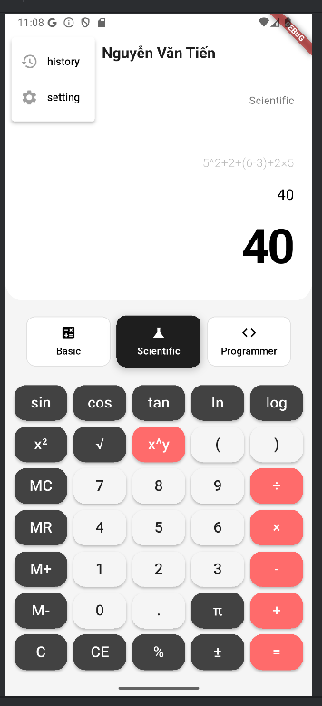 |  | 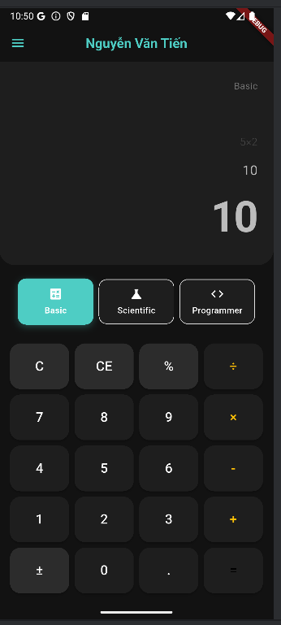 |

### 2. Basic & Scientific Modes
| Basic Operations | Scientific Features | Calculation |
|:---:|:---:|:---:|
| 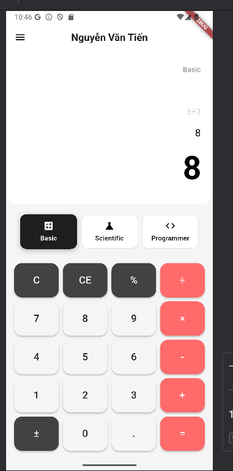 | 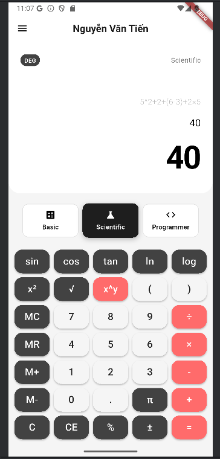 | 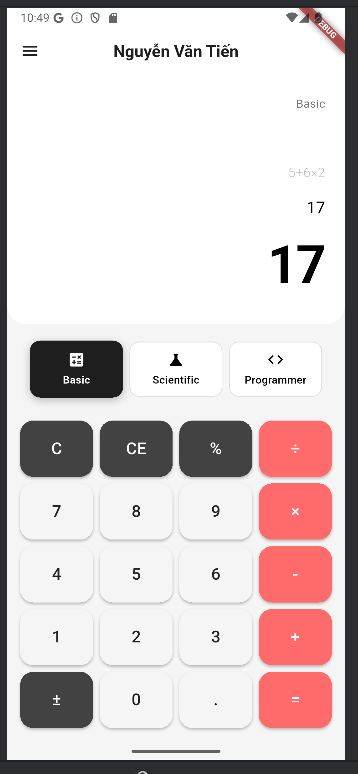 |

### 3. Programmer Mode
| Bitwise Ops | Hex/Bin Conversion | Keypad |
|:---:|:---:|:---:|
| 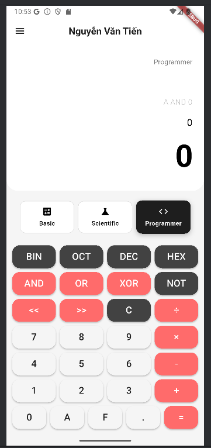 | 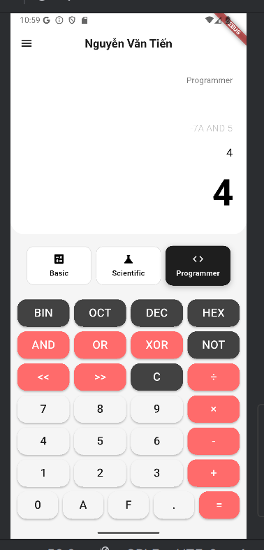 | 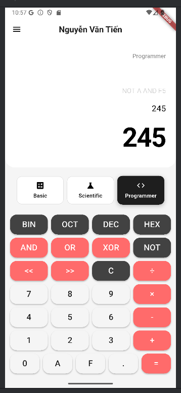 |

### 4. History & Settings
| History Log | Settings Menu | Theme Selection |
|:---:|:---:|:---:|
| 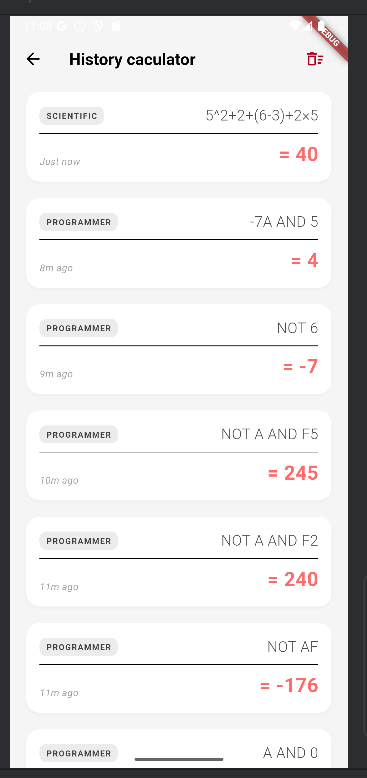 |  | 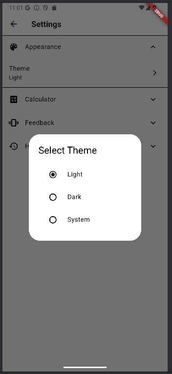 |

### 5. Customization Details
| Angle Mode | Decimal Precision | History Config |
|:---:|:---:|:---:|
|  |  | 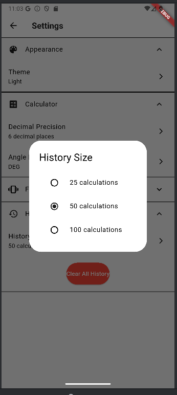 |

## 🏗 Architecture Diagram

The project follows a clean **Layered Architecture** separated by features and responsibilities, managed by `Provider`.

    structure:
    lib/
├── main.dart                  # Entry point, Theme setup, MultiProvider
├── models/                    # Data models
│   ├── calculation_history.dart
│   ├── calculator_mode.dart
│   └── calculator_settings.dart
├── providers/                 # State Management (ChangeNotifier)
│   ├── calculator_provider.dart  # Core logic & State
│   ├── history_provider.dart     # History list management
│   └── theme_provider.dart       # Theme switching logic
├── screens/                   # UI Pages
│   ├── calculator_screen.dart    # Main interface
│   ├── history_screen.dart       # History list view
│   └── settings_screen.dart      # User preferences
├── services/                  # External services
│   └── storage_service.dart      # Shared_preferences wrapper
├── utils/                     # Pure logic & Helpers
│   ├── calculator_logic.dart     # Math logic
│   ├── expression_parser.dart    # String parsing (math_expressions)
│   ├── programmer_calculator.dart# Base conversion logic
│   └── constants.dart            # Strings & Configs
└── widgets/                   # Reusable UI Components
    ├── button_grid.dart
    ├── calculator_button.dart
    ├── display_area.dart
    └── mode_selector.dart